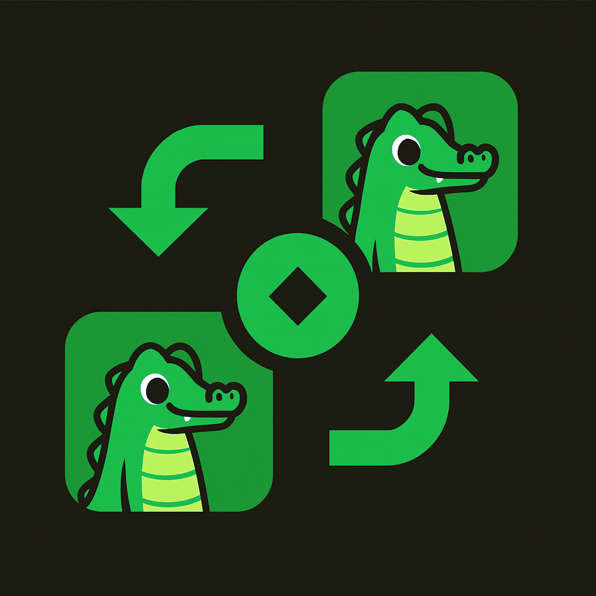

## Project Overview

This is a Wails application called "krokodyl" that provides a desktop GUI for peer-to-peer file transfers using the croc protocol. The application is built with:

- **Backend**: Go with Wails v2 framework
- **Frontend**: Svelte with TypeScript and Vite
- **File Transfer**: Uses the croc library (github.com/schollz/croc/v10) for secure P2P file transfers

## Architecture

The application follows a typical Wails structure:

- `main.go` - Entry point that initializes the Wails application
- `app.go` - Core application logic with file transfer functionality
- `frontend/` - Svelte TypeScript frontend
- `wails.json` - Wails configuration file

### Key Components

**Go Backend (`app.go`):**
- `App` struct manages file transfers and application state
- `FileTransfer` struct represents transfer operations with status tracking
- Main methods: `SendFile()`, `ReceiveFile()`, `SelectFile()`, `SelectDirectory()`
- Uses croc protocol with relay servers for secure P2P transfers
- Emits events to frontend for real-time progress updates

**Frontend (`frontend/`):**
- Svelte 3 with TypeScript
- Vite as build tool
- Communicates with Go backend through Wails bindings

## Development Commands

### Running the Application
```bash
wails dev
```
This starts the development server with hot reload. A dev server runs on http://localhost:34115 for browser-based development.

### Building
```bash
wails build
```
Creates a production build of the application.

### Frontend Development
```bash
cd frontend
npm install          # Install dependencies
npm run dev          # Start Vite dev server
npm run build        # Build frontend
npm run preview      # Preview built frontend
npm run check        # Run svelte-check for TypeScript validation
```

### Go Development
```bash
go mod tidy          # Clean up Go dependencies
go build             # Build Go binary
```

## File Transfer Flow

1. **Sending**: User selects file → App creates transfer record → Uses croc to send via relay servers → Generates shareable code
2. **Receiving**: User enters code and selects destination → App uses croc to receive files → Updates transfer status

Transfer statuses: preparing → sending/receiving → completed/error

## Testing

No specific test commands are configured in the project. Use standard Go testing:
```bash
go test ./...
```

## Key Dependencies

- `github.com/wailsapp/wails/v2` - Cross-platform desktop app framework
- `github.com/schollz/croc/v10` - Secure P2P file transfer library
- `github.com/sirupsen/logrus` - Structured logging
- `github.com/pkg/errors` - Error handling with stack traces