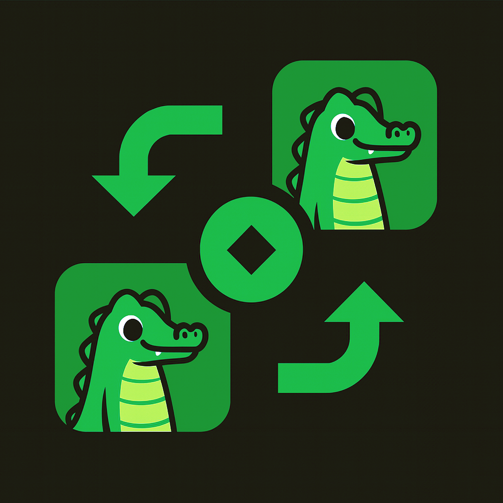

# krokodyl

A small, AirDrop-style **peer-to-peer file transfer** desktop app. Drop files, share a code (or just pick a nearby device), and they move directly between machines over the [croc](https://github.com/schollz/croc) protocol — LAN or across the internet, encrypted end-to-end. No account, no cloud, no size limit.

- **Backend:** Go + [Wails v2](https://wails.io)
- **Frontend:** Svelte 5 (runes) + TypeScript + Vite
- **Transport:** `github.com/schollz/croc/v10` (PAKE-secured P2P)

## Features

- **Code transfer** — share a short human code; works on the same LAN or across networks.
- **Nearby devices** — AirDrop-style discovery on the local network; send with no code, just pick a device. What arrives is checked against what was offered — a mismatch asks you before anything is kept.
- **Resilient transfers** — survives Wi-Fi drops: stall detection, auto-reconnect, and **resume from where it left off** (the progress bar continues instead of restarting).
- **Big files** — streamed and chunked; no practical size cap.
- **Resend** — repeat a past transfer to the same device in one click (remembers the device even if it renamed); you confirm the target's name and address before anything is sent.
- **Native shell** — platform window chrome, light/dark themes, 6 languages (en/nl/fr/es/hu/zh), and a WCAG 2.1 AA accessible UI.
- **Cross-platform** — Windows, macOS (universal), Linux.

## Security

- **Transfers** are end-to-end encrypted by croc's PAKE: the short code is the shared secret; the relay never sees plaintext.
- **Nearby control channel** is TLS 1.3, pinned to the certificate fingerprint each device announces — and because LAN announcements are inherently unauthenticated, every consequential action keeps a human in the loop: you accept offers, confirm resend targets, and approve any received content that doesn't match the offer.
- **Untrusted input is sanitized and contained**: sender-supplied file names are validated against path traversal (including Windows device names and NTFS tricks), display names are stripped of control and BiDi-spoofing characters, and wire messages are size-capped with per-source rate limiting.
- Settings and history are stored owner-only (0600); transfer codes are never logged or persisted.

## Installation

Download the latest build for your platform from the [releases page](../../releases).

### macOS

The app is not notarized (there is no Apple Developer account behind this project), so macOS
shows an "unidentified developer" warning the first time you open it:

1. Download and unzip `krokodyl-macos-universal.zip`
2. Move `krokodyl.app` to your Applications folder (optional)
3. Right-click `krokodyl.app` → **Open** → **Open**

That's only needed once; afterwards it opens like any other app.

### Windows / Linux

Download the binary and run it. On Linux, make it executable first: `chmod +x krokodyl-linux`.

### Logs

If something goes wrong, the app writes a log you can attach to a bug report:

- macOS: `~/Library/Caches/krokodyl/krokodyl.log`
- Windows: `%LOCALAPPDATA%\krokodyl\krokodyl.log`
- Linux: `~/.cache/krokodyl/krokodyl.log`

## Development

### Prerequisites

- **Go** 1.25+
- **Node.js** 22+
- **Wails CLI** v2.12.0 — `go install github.com/wailsapp/wails/v2/cmd/wails@v2.12.0` (keep in sync with `go.mod`)
- **Linux only:** `gcc libgtk-3-dev libwebkit2gtk-4.1-dev`
- Check your toolchain with `wails doctor`

### Run & build

```bash
wails dev          # hot-reload dev (Go + Vite); browser debug at http://localhost:34115
wails build        # production build → build/bin/krokodyl(.exe)

# Linux MUST pass the webkit tag (links libwebkit2gtk-4.1, not 4.0):
wails build -platform linux/amd64 -tags webkit2_41
```

### Test & check

```bash
go test -race ./...                          # full Go test gate (every source file has a _test.go sibling)
go test -race -run TestName ./...            # a single test
gofmt -w . && go vet ./...                   # format + static analysis

cd frontend && npm install && npm run check  # svelte-check: TypeScript + accessibility gate (expect 0/0)
```

> Nearby-device and transfer features need **two real machines** to test properly — loopback/single-instance hides cross-network, "room not ready", and virtual-adapter (VM↔host) bugs. On Windows, test the **built GUI**, not `go run` (a terminal masks a GUI-subsystem stderr bug).

### Project layout

```
*.go                  # Go backend, package main, flat at repo root
  main.go             #   entry; dispatches GUI vs --transfer-worker child process
  app.go              #   GUI orchestration + Wails-bound API
  worker.go           #   per-transfer subprocess (one croc transfer, then exits)
  recovery.go stall.go#   retry/resume + stall watchdog
  discovery.go nearby.go netaddr.go names.go   # LAN discovery + nearby send
  settings.go history.go staging.go transfers.go
frontend/src/         # Svelte 5 app (App.svelte is the hub)
frontend/wailsjs/      # GENERATED Go↔TS bindings — do not hand-edit
docs/CODEMAPS/        # token-lean architecture maps — start here
CLAUDE.md             # contributor guide / conventions
```

For architecture depth, read [`docs/CODEMAPS/`](docs/CODEMAPS) (system, backend, frontend, data, dependencies) and [`CLAUDE.md`](CLAUDE.md).

### How it works (in one paragraph)

The app is **one binary that runs in two modes**: the GUI process, and — spawned per transfer — a `--transfer-worker` child that runs a single croc send/receive and exits. The subprocess model gives kill-based cancellation, working-directory isolation, and crash isolation. A recovery loop retries dropped transfers with backoff and resumes from a deterministic staging directory, so a flaky link doesn't lose progress. Nearby discovery uses LAN multicast to advertise devices and an ephemeral pinned-TLS channel to hand off the croc code without typing.

## Contributing

- Conventional commit subjects: `feat:` / `fix:` / `refactor:` / `docs:` / `test:` / `chore:` / `perf:` / `ci:`.
- When you change a Go method exposed to the frontend, regenerate the `wailsjs/` bindings (don't hand-edit them).
- When you add a UI string, add it to **all** locale files in `frontend/src/locales/`.
- Releases are cut by pushing a `v*` tag on `main`, which triggers the GitHub Actions build + publish.

## Key Dependencies

- [`wailsapp/wails/v2`](https://github.com/wailsapp/wails) — cross-platform desktop framework (webview + Go IPC)
- [`schollz/croc/v10`](https://github.com/schollz/croc) — secure P2P file transfer
- [`schollz/peerdiscovery`](https://github.com/schollz/peerdiscovery) — LAN multicast discovery
- [`sirupsen/logrus`](https://github.com/sirupsen/logrus) — structured logging
- `svelte` 5 · `vite` 6 · `svelte-i18n` — frontend
